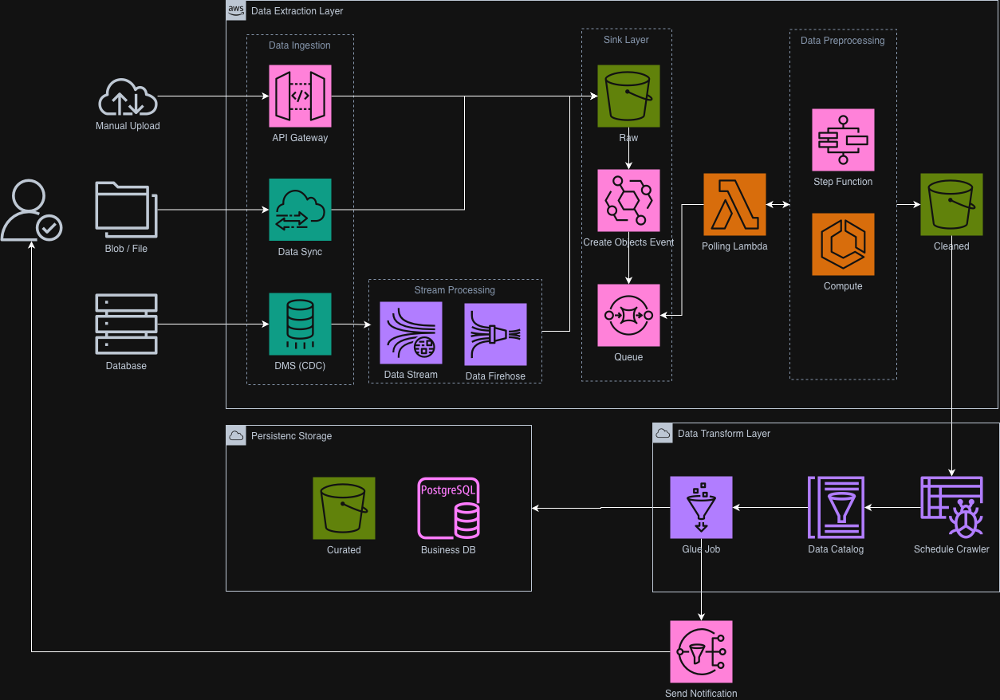

# Cloud-Native 架構圖索引

此資料夾彙整雲原生、容器化與微服務相關的架構圖。每張圖皆提供 Markdown 預覽與簡短說明，方便快速了解設計重點。

## 圖面列表
- **資料湖 ETL 流程（雲原生部署）**

  

  - 說明：展示在雲原生環境中執行資料湖 ETL 的主要元件與資料流（來源、處理、儲存、分析）。
  - 補充：若需修改圖面，可使用 Draw.io 重新編輯原始檔並另存版本。

## 更新指引
1. 新增圖檔後，在上述「圖面列表」中建立新的小節。
2. 提供圖說與應用情境，必要時連結到其他文件（例如部署手冊、Terraform 代碼）。
3. 若引入新技術堆疊，請同步更新檔名及相關描述，確保後續維護容易。

