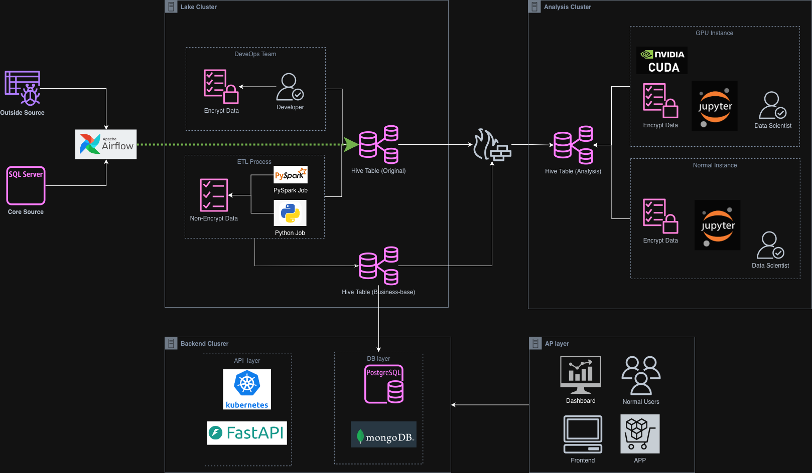

# DataOps 架構圖索引

本資料夾收錄與資料治理、資料湖與管線自動化相關的架構設計，便於追蹤資料流向與平台組件。

## 圖面列表
- **資料湖整體架構**

  

  - 說明：描繪資料由來源進入資料湖、經過處理與治理後，提供給分析與應用服務的完整流程。
  - 補充：可搭配資料治理策略、資安與監控設計使用，建議於修改後追加版本號。

## 更新指引
1. 圖檔命名遵循 `{領域}-{主題}-{版本}.{副檔名}`，例如 `dataops-streaming-pipeline-v1.drawio`。
2. 新增圖面後，記錄其目的、關鍵元件與假設前提，必要時連結到外部文件或程式碼庫。
3. 若圖面涉及機敏資訊，請在圖內或文字說明中明確標註，並遵循內部資料安全政策。

